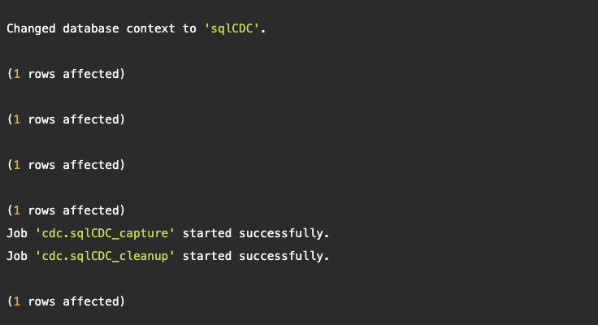
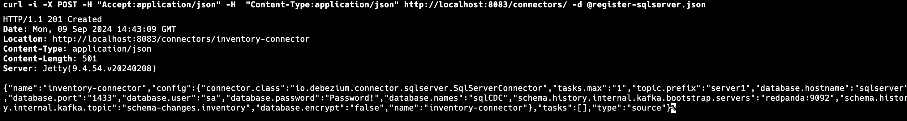

1. Run docker-compose up
2. Run sql scripts
  ```
  cat sql-generator.sql | docker exec -i sqlserver /opt/mssql-tools18/bin/sqlcmd -S localhost -U sa -C -P Password!
  ```

  You should see an output similar to the following:

  
3. Run to apply these configurations using curl to call the exposed Debezium REST API 

```
curl -i -X POST -H "Accept:application/json" -H  "Content-Type:application/json" http://localhost:8083/connectors/ -d @register-sqlserver.json
```
  You should see an output similar to the following:

  

